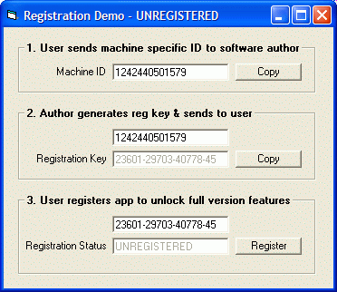



## Software Registration key derived from PC hardware components  \*\*\* Updated \*\*\*

### Description

This is a simplified example that shows how to register an app to individual PCs using a key that is derived from unique properties such as the CPU ID, OS serial, MAC address etc.

It's real easy to do & secure enough to keep most users honest. Feel free to modify & use it as you see fit & please vote if you find it useful. Any feedback or comments are welcome and why not take up my cracking challenge - no one has succeeded yet!

It uses WMI so if you're running W95, W98 or NT4 & you get an automation error download the WMI engine from: http://download.microsoft.com/download/platformsdk/wmicore/1.5/W9XNT4/EN-US/wmicore.EXE.

Update info: The app is even more secure as it now includes complete obfuscation of the key variable and a simple and easily expandable anti-hacking routine (currently includes RegMon, FileMon, SoftICE - routine is adapted from Kevin Lingofelter's code at http://www.planet-source-code.com/vb/scripts/ShowCode.asp?txtCodeId=10000&lngWId=1).
 
### More Info
 

             |
---                |---
**Submitted On**   |2003-10-23 18:27:02
**By**             |[Steve W](https://github.com/Planet-Source-Code/PSCIndex/blob/master/ByAuthor/steve-w.md)
**Level**          |Intermediate
**User Rating**    |4.8 (212 globes from 44 users)
**Compatibility**  |VB 6\.0
**Category**       |[Miscellaneous](https://github.com/Planet-Source-Code/PSCIndex/blob/master/ByCategory/miscellaneous__1-1.md)
**World**          |[Visual Basic](https://github.com/Planet-Source-Code/PSCIndex/blob/master/ByWorld/visual-basic.md)
**Archive File**   |[Software\_R16625710232003\.zip](https://github.com/Planet-Source-Code/steve-w-software-registration-key-derived-from-pc-hardware-components-updated__1-48926/archive/master.zip)

